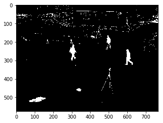

### <b>Relatório Codebook - Frederico Curti </b><br/> Visão computacional Insper 2018 - Prof. Raul Ikeda
___
**UPDATE:** - Link do arquivo pickle (training.p) :https://drive.google.com/file/d/1aQbNh-maSOC_d7JRqZPSLidujqC96uqP/view?usp=sharing

## Descrição do Projeto
O objetivo desse projeto era a implementação do algoritmo *Real-time foreground–background segmentation using codebook model* proposto [neste artigo](/codebook.pdf) para segmentar uma imagem entre foreground e background. Ele consiste na criação e comparação de elementos chamados codebooks para cada pixel de  uma imagem de câmera estácionaria. Esses codebooks armazenam múltiplos codewords, a partir dos quais pode-se determinar o plano daquele pixel. 
Além da implementação do algoritmo, foi necessário aplicar algum método livre para contar quantas pessoas transitavam por cada cena.

## Metodologia
### 1. Treinamento
O algoritmo exige uma etapa de treinamento para preparar os codebooks para cada imagem estacionária, de forma a obter um resultado mais confiável e possibilitar uma separação imediata durante a execução *real-time*. 
Para a realização dessa etapa, são sorteadas 20 imagens que mostram a cena que será processada sem nenhum elemento de interesse, ou seja, mostram só o background. Essas 20 imagens são compostas por 4 conjuntos de 5 imagens aleatórias. Cada conjunto é proveniente de uma pasta que retrata um intervalo temporal distinto. Isso é feito para que o treinamento seja capaz de considerar a mesma cena em diferentes horários, o que invariavelmente afeta a iluminação e os valores dos pixels de cada cena. 

Essa etapa, no entanto, é consideravelmente custosa em termos de processamento, o que levou a motivação de armazenar os resultados desse treinamento em um arquivo (pickle) para sua leitura posterior, evitando a repetição do treinamento e possibilitando a execução direta do algoritmo em si.

- Sorteio das imagens que serão usadas no treinamento
```python
bg_images = []
view_folder = './samples/Crowd_PETS09 2/S0/Background/View_001'
folders = sorted(os.listdir(view_folder))
samples_per_folder = 5
for f in folders[1:]: # Slice avoiding damned macOS .DS_Store file
    p = f'{view_folder}/{f}'
    imgs = os.listdir(p)
    imgs = [f'{p}/{random.choice(imgs)}' for n in range(samples_per_folder)]
    bg_images.extend(imgs)
```

- Execução do treinamento e armazenamento no arquivo `training.p`
```python
# PARAMS
epsilon = 12
alpha = 0.5 # (0.4<=alpha<=0.7) - less means larger brightness bounds
beta = 1.4 # (1.1<=beta<=1.5) - used for limiting I_high

# For each training image
for t in range(len(bg_images)):
    img_path = bg_images[t]
    img = cv.imread(img_path)
    rows, cols = img.shape[:2]

    for i in range(rows):
        for j in range(cols):
            # For each pixel get it's value and codebook
            pixel = img[i][j].astype(float)
            pixel_codebook = codebooks[i][j]

            # calculate I (brightness) for the pixel
            I = math.sqrt(pixel[0]**2 + pixel[1]**2 + pixel[2]**2)
            
            matched = False
            k = 0

            # Attempt to match any codewords with current pixel
            while not matched and k < len(pixel_codebook):
                cw = pixel_codebook[k]
              
                # eq (2) and (3) from article
                xt2 = pixel[0]**2 + pixel[1]**2 + pixel[2]**2
                vi2 = cw[0][0]**2 + cw[0][1]**2 + cw[0][2]**2 
                xtvi2 = (cw[0][0]*pixel[0] + cw[0][1]*pixel[1] + cw[0][2]*pixel[2])**2
                p2 = xtvi2/vi2
                sigma = math.sqrt(abs(xt2 - p2))
                I_low = alpha*cw[2]
                I_high = min(beta*cw[2], cw[1]/alpha)
                xt = math.sqrt(pixel[0]**2 + pixel[1]**2 + pixel[2]**2)
                
                # If there`s a match
                if (sigma <= epsilon) and (I_low <= xt <= I_high):
                    matched = True
                    match_count += 1

                    # Update codeword as in step II.iv of the Codebook construction
                    cw[0] = ((cw[3]*cw[0]) + pixel) / (cw[3] + 1)
                    cw[1] = max(I, cw[1])
                    cw[2] = max(I, cw[2])
                    cw[3] += 1
                    cw[4] = max(cw[4], t - cw[6])
                    cw[5] = cw[5]
                    cw[6] = t
                k += 1 
            
            # Else create a new one as in step II.iii 
            if matched == False:
                pixel_codebook.append([pixel, I, I, 1, t - 1, t, t])

# Step III of the Algorith for Codebook construction session
rows, cols = img.shape[:2]
N = len(bg_images)
for i in range(rows):
    for j in range(cols):
        for cw in codebooks[i][j]:
            cw[4] = max(cw[4], (N - cw[6] + cw[5] - 1))
            
pickle.dump(codebooks, open("training.p", "wb"))
#Saved training to training.p
```
- Os parâmetros alpha, beta e episilon usados nessa etapa foram semi-arbitrários, contidos dentro dos intervalos sugeridos. Posteriormente eu fiz um script para paralelizar variações desses parâmetros e observar manualmente quais apresentavam os melhores resultados

### 2. Extração de Background e Foreground

O processo de extração do foreground e background da imagem se assemelha muito em termos de código à etapa de treinamento, no qual para uma única imagem basta percorrer os codebooks correspondentes a cada pixel, adquiridos na etapa de treinamento, e ver se algum dos codewords dá *match* com o pixel da imagem de entrada. Caso isso ocorra, o pixel é um pixel de background. Caso contrário, ele é um pixel de foreground. Em uma sequência temporal de imagens, é necessário atualizar os codewords da mesma forma como é feito no treinamento, para que um novo objeto fixo inserido na cena durante a execução possa ser eventualmente tratado como parte do background. O maior desafio nessa etapa foi encontrar os melhores parâmetros alpha, beta e epsilon para a filtragem. Para resolver tal problema, permutei vários parâmetros possíveis com o pacote `concurrent` para determinar 'no olho' bons parâmetros. Um bom conjunto observado foi
- alpha: 0.5,
- beta: 1.4
- epsilon: 32

A imagem abaixo é resultado de uma dessas filtragens. Em branco está o que foi determinado Foreground e em preto, Background.



### 3. Contagem

Para realizar a contagem das pessoas em trânsito na cena, foi adotado o método Simple Blob Detection disponível no OpenCV como `cv.SimpleBlobDetector`. Porém, como pode-se observar na imagem acima, ainda existe bastante ruído que poderia interferir com a detecção desses blobs. Para isso adotei a seguinte sequência de tratamentos na imagem segmentada:
 - I. Blur (`cv.blur`) - O blur ajudou a 'diluir' o ruído do fundo além de conectar melhor algumas partes dos corpos das pessoas que estavam fragmentadas
 - II. Erosion (`cv.erode`) - A erosão ajudou a praticamente acabar com o ruído
 - III. Dilation (`cv.dilate`) - A dilatação dos elementos restantes ajudou a ressaltar as pessoas e preencher alguns vazios nos corpos para evitar que uma pessoa pudesse ser detectada como dois ou mais blobs não propositalmente.

 Os parâmetros desses tratamentos, como o tamanho do kernel, foram definidos através de tentativa e erro, buscando sempre se aproximar da melhor maneira do resultado desejado.

Além disso, foi necessário especificar alguns parâmetros para o `SimpleBlobDetector`. [Esses parâmetros](https://docs.opencv.org/3.4/d8/da7/structcv_1_1SimpleBlobDetector_1_1Params.html#a5fdde080e684655ad634a3be4fb52888) foram fundamentais para a detecção correta dos elementos desejados, especificando atributos como o diâmetro mínimo de um blob ou características de seu formato:
   ```python 
    d = 15 #diâmetro mínimo de um blob
    params.filterByArea = True
    params.minArea = 3.14159 * d * d
    params.filterByColor = False
    params.filterByCircularity = False
    params.filterByConvexity = True
    params.minConvexity = 0.3
    params.filterByInertia = True
    params.maxInertiaRatio = 0.75 
    params.minDistBetweenBlobs = 0
```
Eles também foram atribuídos através de tentativa e erro, de forma a se aproximar do resultado esperado


Por fim, foi criada uma função capaz de receber uma sequência de imagens, fazer a segmentação, tratar essas imagens segmentadas, detectar e indicar os blobs. A função `get_blobs` detecta e desenha círculos na imagem para indicar os blobs encontrados.

 ```python
def subtractBG_set(img_set, epsilon = 12, alpha = 0.4, beta = 1.1):
    for t in range(len(img_set)):
        img = img_set[t]
        original = cv.cvtColor(img, cv.COLOR_BGR2RGB)
        for i in range(len(training)):
            # ... match and update

        bde = blur_dilate_and_erode(img)
        spotted_img, amount, keypoints = get_blobs(bde)
        print('FOUND', amount, 'PEOPLE')

    return img, keypoints

fg_images = []
fg_path = 'samples/Crowd_PETS09 3/S0/City_Center/Time_12-34/View_001'
for fg_img_path in sorted(os.listdir(fg_path))[640:645]:
    fg_images.append(cv.imread(fg_path + '/' + fg_img_path))

img, keypoints = subtractBG_set(fg_images, alpha=0.5, beta=1.4, epsilon=32)
```

Os resultados obtidos foram como o seguinte:

`FOUND 6 PEOPLE`

- Os resultados obtidos foram razoáveis. No entando, para casos nos quais existe a sobreposição de pessoas em um determinado frame, os blobs quase sempre 'se juntaram', contando as pessoas sobrepostas como uma única pessoa. Além disso, como muitos parâmetros foram escolhidos à mão, não há garantia de que eles irão funcionar para outro contexto e não há nenhum mecanismo de redundância capaz de variar esses parâmetros caso uma mudança inesperada ocorra na cena.

A implementação completa está [nesse ipython notebook](/codebook-fred.ipynb)
